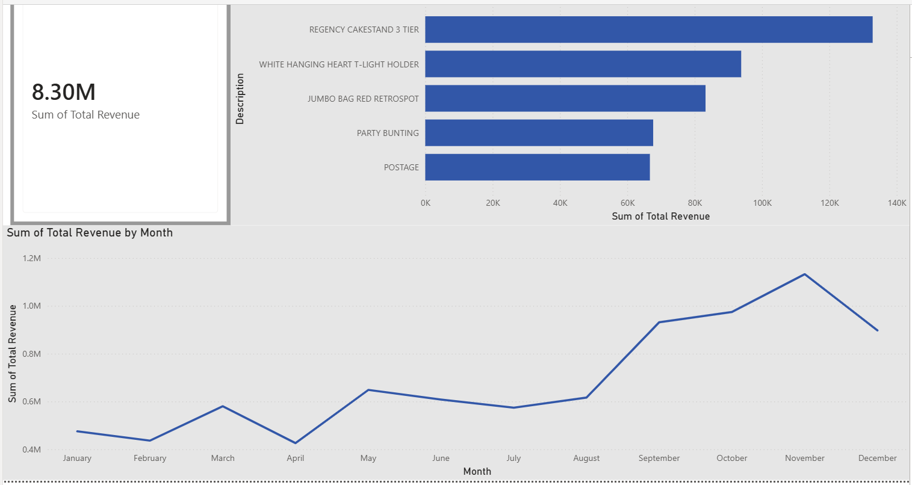

# Business Sales Performance Analytics (Task 1)

## Overview
This repository contains the official submission for **Task 1** of the Data Science & Analytics Internship at Future Interns. The project focuses on analyzing an e-commerce sales dataset to extract actionable business insights, evaluate revenue trends, and identify top-performing products. 

## Dataset
* **Source:** Kaggle (`ulrikthygepedersen/online-retail-dataset`)
* **Description:** A transnational dataset containing transactions occurring between 01/12/2010 and 09/12/2011 for a UK-based and registered non-store online retail.

## Tools & Technologies Used
* **Python** (Data manipulation and initial cleaning)
* **Pandas** (Data aggregation)
* **Power BI** (Interactive dashboard creation and data visualization)

## Key Business Insights

1. **Total Sales Revenue:**
   * The business generated a total revenue of **$8.30M** during the recorded period after data cleaning (removing cancellations, null values, and zero/negative quantities).

2. **Top 5 Products by Revenue:**
   * REGENCY CAKESTAND 3 TIER
   * WHITE HANGING HEART T-LIGHT HOLDER
   * JUMBO BAG RED RETROSPOT
   * PARTY BUNTING
   * POSTAGE

3. **Monthly Revenue Trend:**
   * Sales show significant variance throughout the year, with a massive spike in revenue leading into the final quarter (Q4), peaking in November. 
   * 

## Files in this Repository
* `sales_performance_analysis.py`: The Python script used to explore and clean the initial dataset.
* `Sales_Dashboard.pbix`: The interactive Power BI dashboard file containing the final visualizations.
* `powerbi_dashboard.png`: A high-quality screenshot of the completed Power BI dashboard.
* `README.md`: Project documentation and findings summary.
